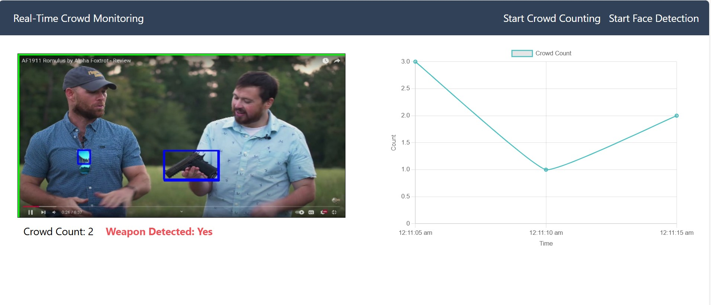
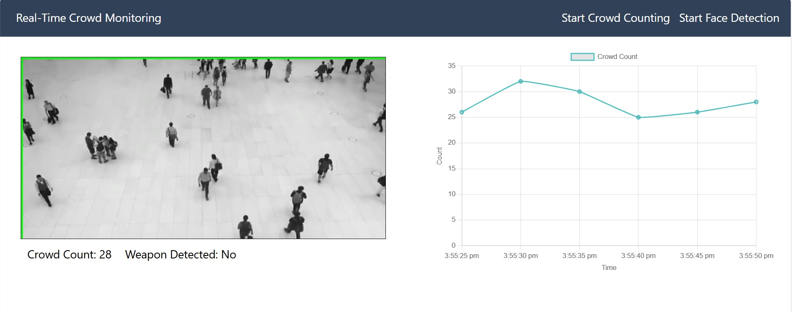

# Real-Time Crowd Monitoring

## 📌 Project Overview
The **Real-Time Crowd Monitoring** system is an AI-powered solution that utilizes computer vision and deep learning to analyze live video feeds. It provides real-time crowd density estimation, movement tracking, and anomaly detection to enhance safety and improve crowd management in public spaces.

## 🚀 Features
- **Real-Time Object Detection**: Uses YOLO (You Only Look Once) for detecting people in video feeds.
- **Crowd Tracking**: Implements Deep SORT for tracking individuals and analyzing movement patterns.
- **Density Estimation**: Provides real-time crowd count and density analysis.
- **Anomaly Detection**: Detects unusual behavior, such as sudden dispersal or congestion.
- **Flask Web Interface**: Displays real-time monitoring results on a web-based dashboard.
- **Weapon Detection (Optional)**: Identifies potential threats for enhanced security.

## 🛠️ Tech Stack
- **Backend**: Flask (for real-time data processing)
- **Machine Learning**: YOLOv3-tiny / YOLOv5
- **Frameworks & Libraries**: TensorFlow, OpenCV, NumPy, Pandas
- **Streaming**: Flask-SocketIO for real-time updates

## 💂️ Screenshots
### Weapon Detection

### Crowd Count


## 📂 Project Structure
```
├── modules/          # Contains model and processing scripts
├── photos/           # Stores images related to the project
├── static/           # Static assets for the web UI
├── templates/        # HTML templates for Flask UI
├── test_videos/      # Sample videos for testing
├── .gitignore        # Ignored files
├── app.py            # Main backend script
├── requirements.txt  # Dependencies
```

## 🔧 Installation & Setup
### 1️⃣ Clone the Repository
```bash
git clone https://github.com/yourusername/real-time-crowd-monitoring.git
cd real-time-crowd-monitoring
```

### 2️⃣ Create a Virtual Environment & Install Dependencies
```bash
python -m venv venv 
source venv/bin/activate  # (On Windows use `venv\Scripts\activate`)
pip install -r requirements.txt
```

### 3️⃣ Running the System
```bash
python app.py
```
Ensure the server is running, then open [http://localhost:5000](http://localhost:5000) to access the Flask interface.

## 📊 Usage Guide
1. **Upload a Video / Use a Live Camera Feed**: The system will automatically start detecting and tracking people.
2. **Monitor Crowd Insights**: View real-time analytics, including crowd count, density, and movement patterns.
3. **Alerts & Notifications**: If an anomaly (e.g., overcrowding, weapon detection) is detected, an alert is triggered.

## ⚡ Future Enhancements
- Integration with **IoT sensors** for crowd analysis in smart cities.
- **Predictive modeling** to forecast crowd behavior.
- **Multi-camera support** for larger areas.
- **Cloud deployment** for scalability.

## 🤝 Contributing
Pull requests are welcome! For major changes, please open an issue first to discuss what you’d like to change.

## 📜 License
This project is licensed under the MIT License. Feel free to use and modify it as needed.

## 📞 Contact
For inquiries, reach out at **varun200430@outlook.com** / **https://www.linkedin.com/in/varun-tiwari-59a832268**

